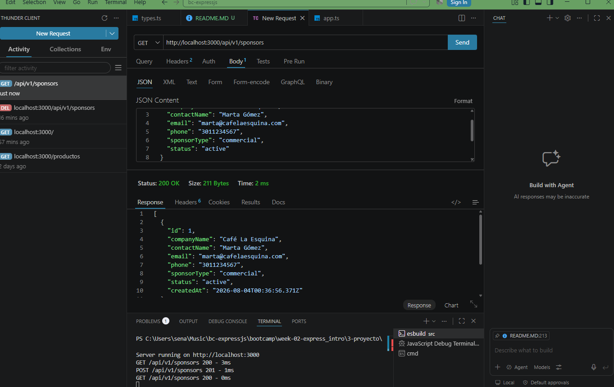
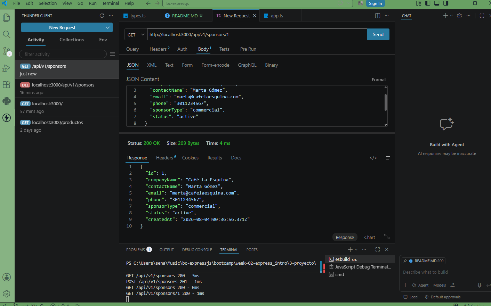
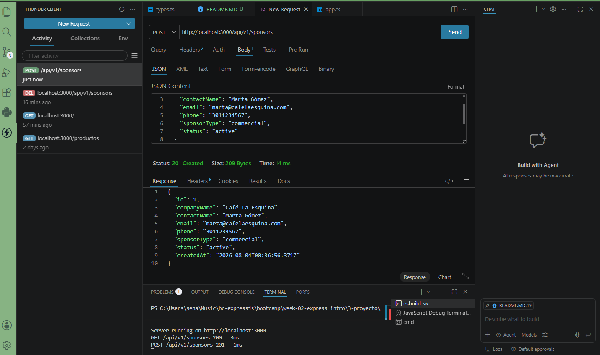
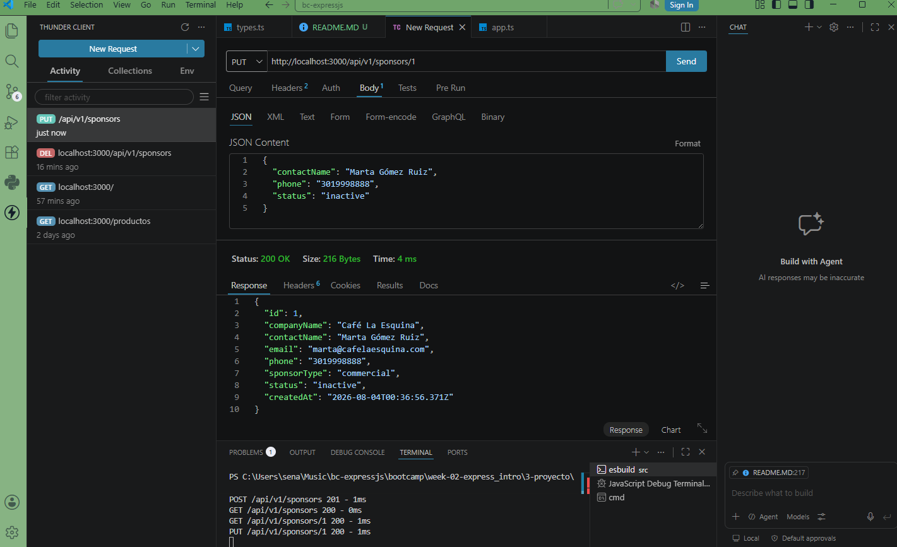
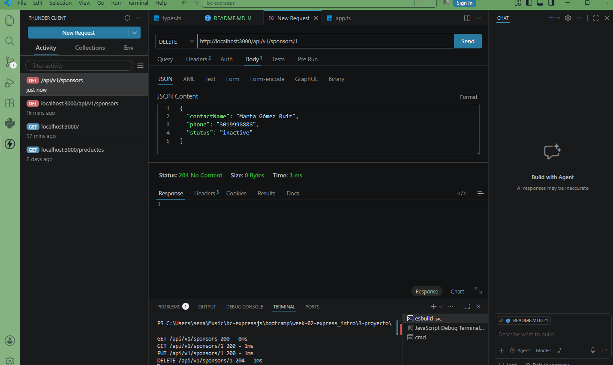
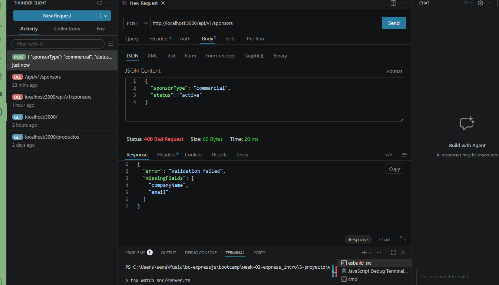
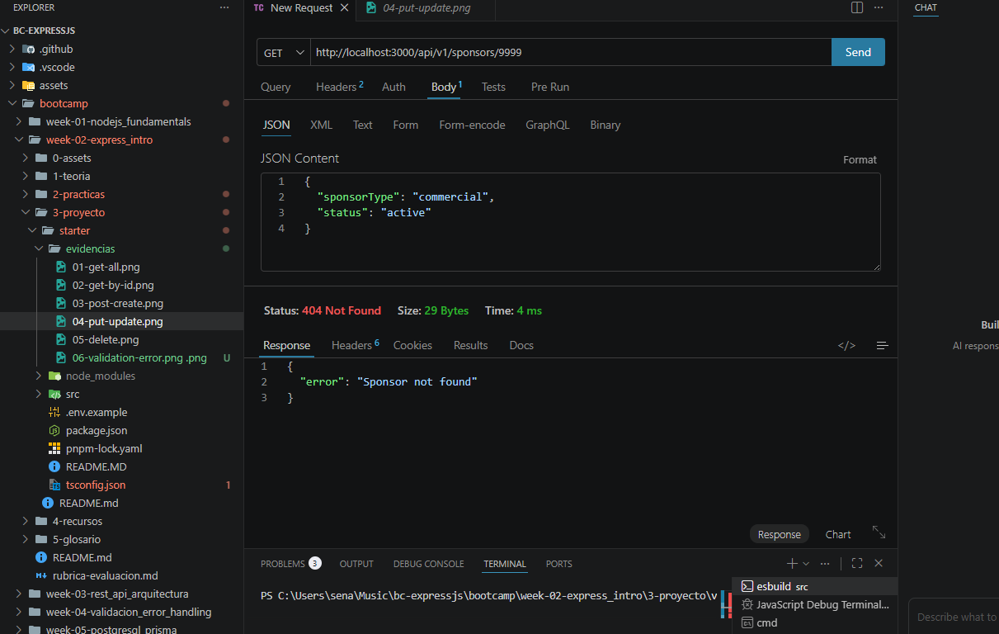

# API REST — Radio Comunitaria (Sponsors)

Proyecto semana 02 del bootcamp bc-expressjs (ficha 3228970). API REST construida con Express 5 y TypeScript para la gestión de una radio comunitaria.

## Dominio

Radio comunitaria, con las siguientes entidades del modelo de datos:

- Programs — programas de la radio
- Hosts — locutores/presentadores
- Schedules — horarios de emisión
- Sponsors — patrocinadores (recurso implementado en esta entrega)

## Stack

- Node.js + Express 5
- TypeScript
- Store en memoria (sin base de datos)

## Cómo correr el proyecto

```bash
pnpm install
pnpm dev
```

El servidor levanta por defecto en `http://localhost:3000`.

## Health check

```
GET /health
```

Verifica que el servidor esté corriendo.

Respuesta 200:
```json
{ "status": "ok" }
```

## Endpoints — Sponsors

Base URL: `http://localhost:3000/api/v1/sponsors`

### 1. Listar todos los patrocinadores

```
GET /api/v1/sponsors
```

Respuesta 200:
```json
[
  {
    "id": 1,
    "companyName": "Café La Esquina",
    "contactName": "Marta Gómez",
    "email": "marta@cafelaesquina.com",
    "phone": "3011234567",
    "sponsorType": "commercial",
    "status": "active",
    "createdAt": "2026-08-03T20:15:00.000Z"
  }
]
```

### 2. Obtener un patrocinador por ID

```
GET /api/v1/sponsors/:id
```

Parámetros:

| Parámetro | Tipo | Descripción |
|---|---|---|
| id | number | ID del patrocinador |

Respuesta 200: el objeto del patrocinador.

Respuesta 404:
```json
{ "error": "Sponsor not found" }
```

### 3. Crear un patrocinador

```
POST /api/v1/sponsors
Content-Type: application/json
```

Body:
```json
{
  "companyName": "Café La Esquina",
  "contactName": "Marta Gómez",
  "email": "marta@cafelaesquina.com",
  "phone": "3011234567",
  "sponsorType": "commercial",
  "status": "active"
}
```

Campos:

| Campo | Tipo | Obligatorio | Descripción |
|---|---|---|---|
| companyName | string | Sí | Nombre de la empresa patrocinadora |
| contactName | string | No | Nombre de la persona de contacto |
| email | string | Sí | Correo de contacto |
| phone | string | No | Teléfono de contacto |
| sponsorType | commercial / ngo / government / individual | Sí | Tipo de patrocinador |
| logoUrl | string | No | URL del logo |
| status | active / inactive | Sí | Estado del patrocinador |

Respuesta 201: el objeto creado, con id autogenerado y createdAt.

Respuesta 400 (validación): se retorna si falta alguno de los campos obligatorios (companyName, email, sponsorType, status).
```json
{
  "error": "Validation failed",
  "missingFields": ["companyName", "email"]
}
```

### 4. Actualizar un patrocinador

```
PUT /api/v1/sponsors/:id
Content-Type: application/json
```

Body (campos a actualizar, parcial):
```json
{
  "contactName": "Marta Gómez Ruiz",
  "phone": "3019998888",
  "status": "inactive"
}
```

Respuesta 200: el objeto actualizado.

Respuesta 400 (validación): se retorna si el body llega vacío.
```json
{
  "error": "Validation failed",
  "message": "Body cannot be empty"
}
```

Respuesta 404:
```json
{ "error": "Sponsor not found" }
```

### 5. Eliminar un patrocinador

```
DELETE /api/v1/sponsors/:id
```

Respuesta 204: sin body (eliminación exitosa).

Respuesta 404:
```json
{ "error": "Sponsor not found" }
```

## Resumen de rutas

| Método | Ruta | Descripción | Status |
|---|---|---|---|
| GET | /api/v1/sponsors | Listar todos | 200 |
| GET | /api/v1/sponsors/:id | Obtener por ID | 200 / 404 |
| POST | /api/v1/sponsors | Crear | 201 / 400 |
| PUT | /api/v1/sponsors/:id | Actualizar | 200 / 400 / 404 |
| DELETE | /api/v1/sponsors/:id | Eliminar | 204 / 404 |

## Middlewares

- express.json() — parseo del body de las peticiones.
- Logger — registra método, URL, status code y tiempo de respuesta de cada petición.
- 404 handler — captura rutas no definidas.
- Error handler global — captura errores no controlados y responde con 500.

## Decisiones de diseño

- Se optó por implementar primero el recurso Sponsors como entrega de la semana 02, dejando Programs, Hosts y Schedules modelados en types.ts para futuras entregas.
- El store es un array en memoria (sponsorsList) sin persistencia; los datos se pierden al reiniciar el servidor.
- El campo id se autogenera con un contador incremental (nextId).
- PUT actualiza de forma parcial (solo los campos enviados), simulando un merge sobre el recurso existente.
- Se agregó validación básica en POST y PUT para retornar 400 cuando faltan campos obligatorios o el body llega vacío.

## Evidencias

Capturas de Thunder Client mostrando los 5 endpoints en funcionamiento, más los casos de error (400 y 404). Cada captura muestra el método HTTP, la URL, el body enviado (si aplica) y el status code de la respuesta.

Las imágenes están en la carpeta `evidencias/` en la raíz del proyecto.

### Listar todos los sponsors (GET)



### Obtener sponsor por ID (GET)



### Crear sponsor (POST)



### Actualizar sponsor (PUT)



### Eliminar sponsor (DELETE)



### Caso de error — Validación (400)

Petición POST sin los campos obligatorios `companyName` y `email`.



### Caso de error — Recurso no encontrado (404)

Petición GET a un id de sponsor que no existe.

